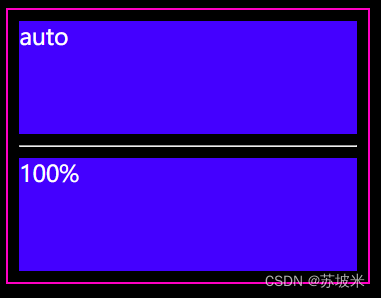
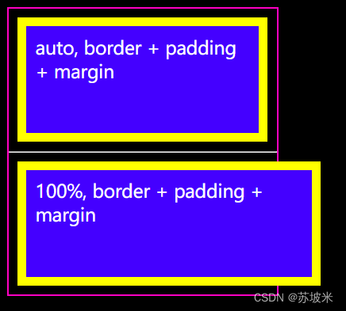

# width:100%  与 width:auto 的区别
## 一、当两者的子元素没有 border 或 padding 或 margin 的时候
先看一下示例代码和效果图
```html
<html lang="en">
  <head>
    <meta charset="UTF-8" />
    <meta name="viewport" content="width=device-width, initial-scale=1.0" />
    <title>Document</title>
    <style>
      * {
        color: white;
        font-size: 20px;
      }
      .out {
        width: 300px;
        border: 2px solid #ff00c3;
        padding: 10px;
      }
      .inner1 {
        width: auto;
        height: 100px;
        background-color: rgb(68, 0, 255);
      }
      .inner2 {
        width: 100%;
        height: 100px;
        background-color: rgb(68, 0, 255);
      }
    </style>
  </head>
  <body style="background-color: black;">
    <div class="out">
      <div class="inner1">auto</div>
      <hr>
      <div class="inner2">100%</div>
    </div>
  </body>
</html>
```
效果如下

当两者都没有 padding 或 margin 或 border 时 效果都是一样的，都能填满父元素的content 部分
## 二、当两者的子元素有 border 或 padding 或 margin 的时候
示例代码
```html
<!DOCTYPE html>
<html lang="en">
  <head>
    <meta charset="UTF-8" />
    <meta name="viewport" content="width=device-width, initial-scale=1.0" />
    <title>Document</title>
    <style>
      * {
        color: white;
        font-size: 20px;
      }
      .out {
        width: 300px;
        border: 2px solid #ff00c3;
        padding: 10p
      }
      .inner3 {
        width: auto;
        height: 100px;
        background-color: rgb(68, 0, 255);
        border: 10px solid yellow;
        margin: 10px;
        padding: 10px;
      }
      .inner4 {
        width: 100%;
        height: 100px;
        background-color: rgb(68, 0, 255);
        border: 10px solid yellow;
        margin: 10px;
        padding: 10px;
      }
    </style>
  </head>
  <body style="background-color: black;">
    <div class="out">
      <div class="inner3">auto, border + padding + margin</div>
      <hr>
      <div class="inner4">100%, border + padding + margin</div>
    </div>
  </body>
</html>
```
效果图如下：

当两者有 padding 或 margin 或 border 时， auto 宽度的子元素 content 不再和父元素的content 对等，而是
```
父元素content =  子元素 content + padding + border + margin
```
而子元素的 宽度为 100% 时，子元素和父元素的content 始终对等

## 综上
+ width:100% : 子元素的 content 撑满父元素的content，如果子元素还有 padding、border等属性，或者是在父元素上设置了边距和填充，都有可能会造成子元素区域溢出显示;

+ width:auto :  是子元素的 content+padding+border+margin 等撑满父元素的 content 区域。
