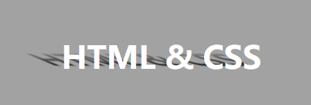

# 使用伪元素加变形做文字阴影效果

## 先看效果



## 完整代码

```html
<!DOCTYPE html>
<html lang="en">
  <head>
    <meta charset="UTF-8" />
    <meta name="viewport" content="width=device-width, initial-scale=1.0" />
    <title>Document</title>
    <style>
      body {
        background-color: #a2a2a2;
      }
      .out {
        padding-top: 100px;
        display: flex;
        justify-content: center;
        align-items: center;
      }
      h1 {
        color: #fff;
        margin: auto;
        position: relative;
        font-weight: bold;
        font-size: 30px;
      }
      h1::after {
        content: 'HTML & CSS';
        color: #000;
        position: absolute;
        left: 0;
        z-index: -1;
        transform: scaleY(0.5) skew(50deg) translate(-29px, 6px);
        filter: blur(1px);
        -webkit-mask: linear-gradient(transparent, #000);
      }
    </style>
  </head>
  <body>
    <div class="out">
      <h1>HTML & CSS</h1>
    </div>
  </body>
</html>

```