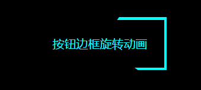

# 按钮边框旋转动画

## 效果预览



## 实现

::: code-group

```html [index.html]
<!doctype html>
<html lang="en">
  <head>
    <meta charset="UTF-8" />
    <meta name="viewport" content="width=device-width, initial-scale=1.0" />
    <link rel="stylesheet" href="base.css" />
  </head>
  <body>
    <button class="button">按钮边框旋转动画</button>
  </body>
</html>
```

```css [base.css]
body {
  background-color: #000;
  display: flex;
  justify-content: center;
  padding-top: 50px;
}
.button {
  height: 60px;
  width: 150px;
  position: relative;
  overflow: hidden;
  background: none;
  color: #00ffff;
  border: none;
}
.button::before {
  content: '';
  position: absolute;
  top: 0;
  left: 0;
  width: 200%;
  height: 200%;
  background-color: #00ffff;
  top: 50%;
  left: 50%;
  z-index: -2;
  transform-origin: left top;
  animation: rota 1.8s infinite linear;
}
.button::after {
  --w: 3px;
  content: '';
  position: absolute;
  z-index: -1;
  background-color: #000;
  top: var(--w);
  left: var(--w);
  width: calc(100% - 2 * var(--w));
  height: calc(100% - 2 * var(--w));
  border-radius: inherit;
}

@keyframes rota {
  to {
    transform: rotate(360deg);
  }
}
```

