# 域名、CDN、Nginx基本概念和设置

## 一、域名的作用
我们知道，域名是用来代替IP地址的，因为IP地址是一串复杂的英文和字符，所以就很难被人们记住，而采用域名的方式来代替IP地址就可以更加轻松的访问该网站了
##### 如何创建域名并且把域名绑定映射到指定ip ?以下新网平台为例

去到新网首页找到“域名注册”就可以进行域名的购买了。购买操作步骤不做详细介绍了。
购买到域名之后（比如kingsware.cn）就可以对其进行ip的绑定了。绑定过程如下：
点击“控制台”--> “域名”-->“域名管理” 打开下图
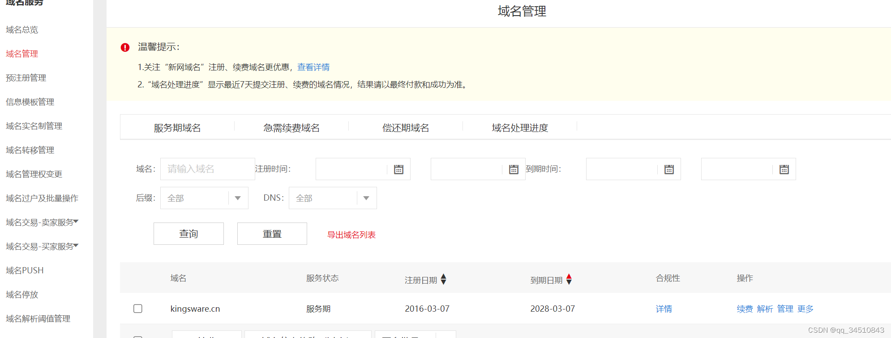
找到域名kingsware.cn 哪一项域名，然后点击“解析”进入域名解析页
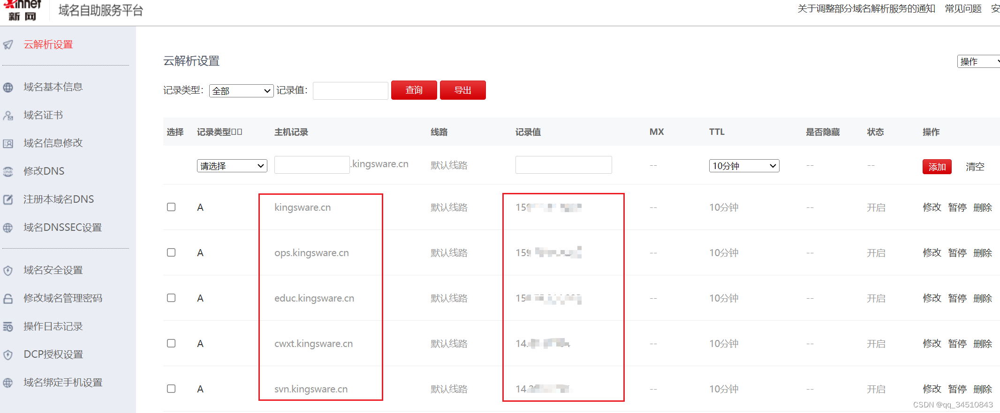
上图可以看到域名kingsware.cn 及其部分子域名绑定的ip地址（记录值）。假如我们要新增一个 xxx.kingsware.cn 指定到 123.123.123.123 ，则根据下图输入主机记录及记录值，点击添加即可
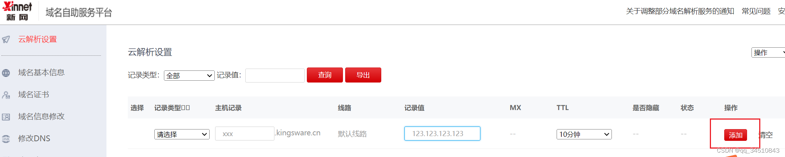
## 二、nginx 发布网站
以上只是做了域名和ip的关联而已。如果我们要对外发布网站。还得搭建我们的NGINX服务器。以下以发布一个xxx.kingsware.cn 的网站为例。
> 注意，以下以centos系统为例，该centos 系统的ip对外地址就是xxx.kingsware.cn 所关联的ip地址

首先安装一个NGINX 中间件
```js
yum install nginx -y
```
然后启动

```js
systemctl start nginx
```
新增一个.conf 后缀的配置文件 ，如web.conf 
```js
vim /etc/nginx/conf.d/web.conf
```
在web.conf 新增一个server 
```nginx
server {
       listen 80;
       location / {
            proxy_pass http://127.0.0.1:8080; # 网站端口
       }
}
```
测试配置文件
```js
nginx -t
```
如果输出以下信息，则表示配置信息配置
```sh
[root@c7-tech-20211112-1 ~]# nginx -t
nginx: the configuration file /etc/nginx/nginx.conf syntax is ok
nginx: configuration file /etc/nginx/nginx.conf test is successful
```
重载nginx 
```js
nginx -s reload
```
然后我们就可以在浏览器通过http://xxx.kingsware.cn 访问网站了
##### 配置给网站增加https协议
以上的步骤是给网站发布了一个http 协议的端口而已。如果我们想要保证网络信息传输的安全性，那就得增加增加 https 协议（详细内容建议参考[https://zhuanlan.zhihu.com/p/449739003](https://zhuanlan.zhihu.com/p/449739003)）。要给域名购买一个ssl证书。购买了证书之后就是增加nginx配置了。配置内容如下

编辑 web.conf 
```js
vim /etc/nginx/conf.d/web.conf
```
内容如下：
```nginx
server {
        listen       443 ssl;
        ssl_certificate      /xxx/1_kingsware.cn_bundle.crt;  # 证书.crt 文件 路径
        ssl_certificate_key  /xxx/2_kingsware.cn.key;  # 证书.key文件路径
        ssl_session_cache    shared:SSL:1m;
        ssl_session_timeout  5m;
        ssl_ciphers  HIGH:!aNULL:!MD5;
        ssl_prefer_server_ciphers  on;
        location / {
                proxy_pass http://127.0.0.1:8080;
        }
   }
   ```

然后我们就可以在浏览器通过 https://xxx.kingsware.cn 访问网站了

## 三、CDN 的作用与概念

cdn 基于这样的一个原理：挑选最优的设备为用户服务，如果某个内容为很多用户所需，他就会被缓存到距离用户最近的节点中。
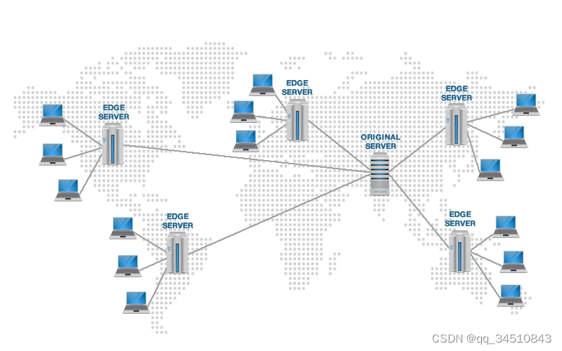


CDN具体的作用有哪些？
>1、节省骨干网带宽、降低带宽的需求量、节约成本。
2、加速功能，解决由于用户访问量大造成的服务器过载问题。
3、克服网站分布不均，降低网站建设和维护成本。
4、提高网络稳定性。
5、可以隐藏源站，还可以防御网络攻击。

##### 如何设置为网站设置cdn？
>以下步骤以腾讯云为例

登录腾讯云，点击“控制台”--> “产品”，找到cdn进行购买即可。
购买完毕之后进入cdn管理页面
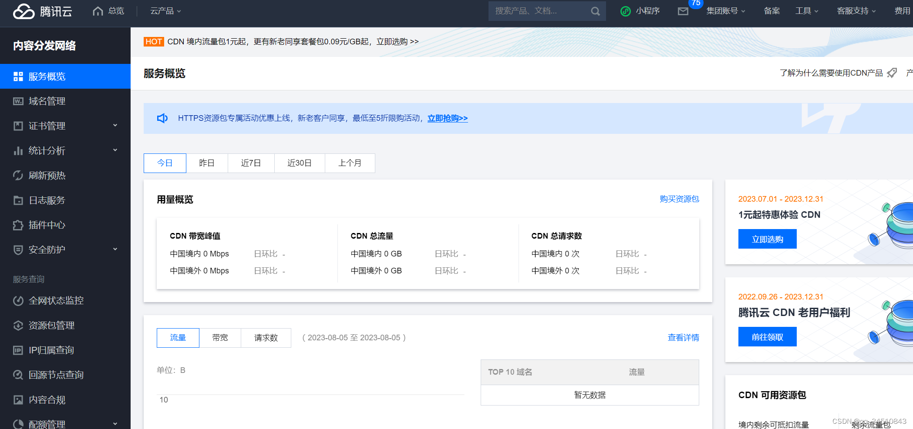
点击“域名管理”--> “添加域名”，如下填写

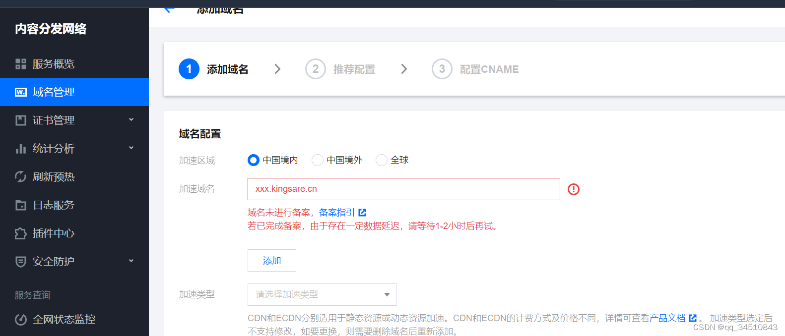
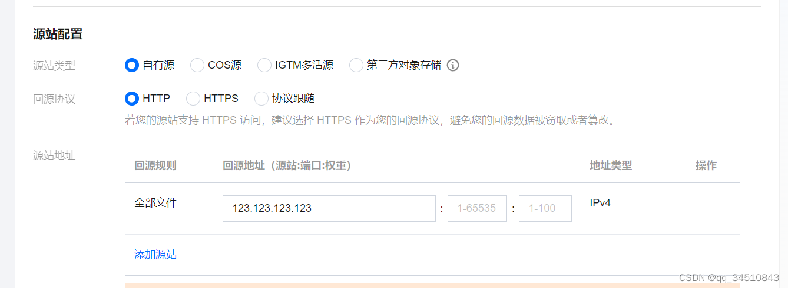


回到腾讯云CDN的管理界面，选择你加速的域名。进入到如下管理界面
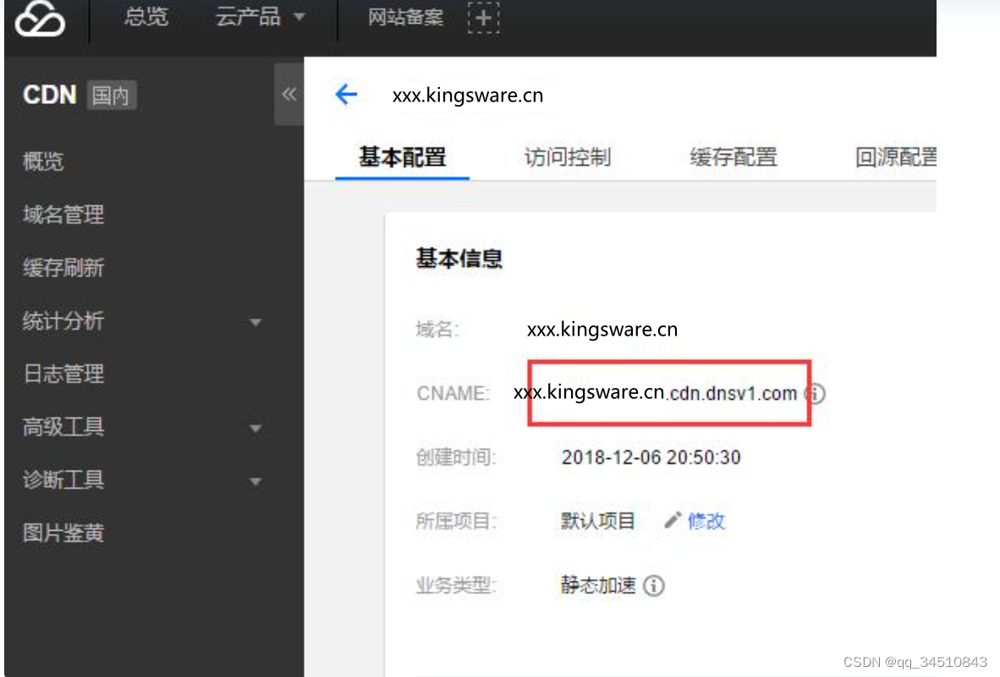

CDN的https设置
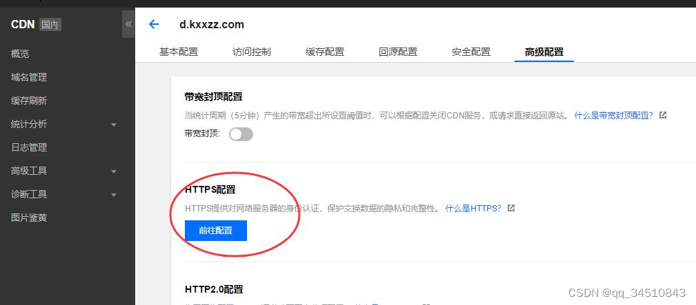

点击高级设置-->HTTPS设置
然后在新打开的页面，上传你的证书和私钥
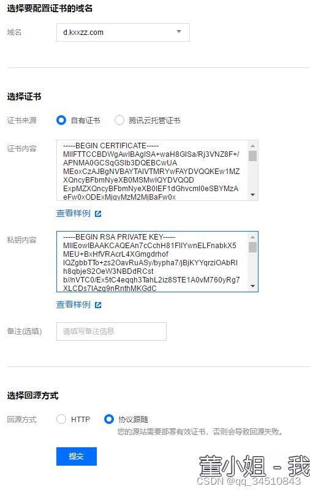

#### 最后修改新网域名解析
进入新网域名解析页面找到xxx.kingsware.cn 域名信息，把它删掉
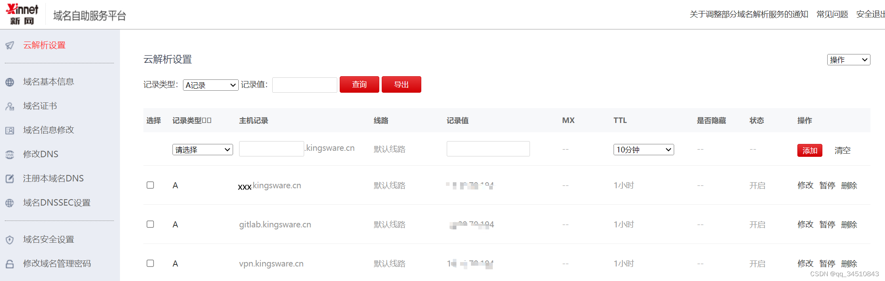

然后增加cname 解析
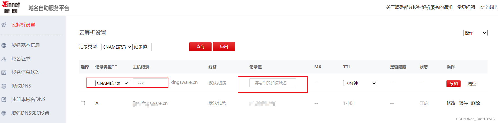
至此，cdn的配置就完成了。