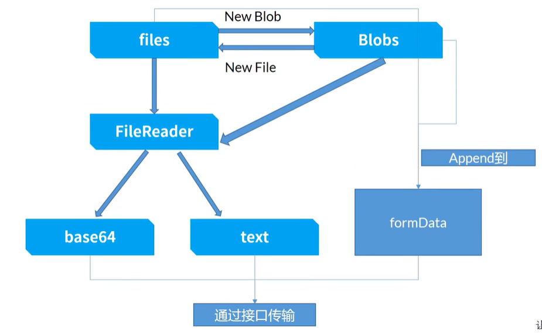

# 文件上传的方式

在前端开发中，文件上传是一个常见的功能需求。为了实现文件上传，有多种方法可以选择。下面，我们将详细介绍两种主要的文件上传方式：通过 `FormData` 提交 `Blob` 二进制内容以及通过提交 `base64` 编码的字符串。


**注意**：以下示例中使用的请求库是 `axios`。

## 使用 `FormData` 传输二进制内容

`File` 对象作为 `Blob` 的子类，可以通过 `FormData` 对象进行传输。通常，我们可以使用 `input` 标签的 `files` 属性获取用户选择的文件，或者通过 `FileReader` 对象来操作文件。

### 前端示例代码

```javascript
// 创建一个 FormData 对象
const formData = new FormData();

// 假设 'file' 是通过某种方式（如 input 标签）获取到的 File 对象
const file = document.querySelector('input[type="file"]').files[0];

// 将文件添加到 FormData 对象中
formData.append("file", file);

// 发送 POST 请求，上传文件
axios.post('/api/upload-formdata', formData, {
  headers: {
    'Content-Type': 'multipart/form-data' // 设置正确的请求头，formData 上传时 axios 会自动添加该请求头
  }
})
```

### 后端的示例代码（egg.js 实现）

```javascript
// app/controller/upload.js

const Controller = require('egg').Controller;

class UploadController extends Controller {
  async uploadFormData() {
    const { ctx } = this;
    const stream = await ctx.getFileStream();
    const filename = path.basename(stream.filename);
    const target = path.join(this.config.baseDir, 'app/public', filename);
    const writeStream = fs.createWriteStream(target);
    try {
      await new Promise((resolve, reject) => {
        stream.pipe(writeStream);
        stream.on('end', resolve);
        stream.on('error', reject);
      });
      ctx.body = {
        url: '/public/' + filename,
        fields: stream.fields,
      };
    } catch (err) {
      // await sendToWormhole(stream);
      console.log('上传失败', err);
      throw err;
    }
  }
}
```

## 提交 `base64` 编码的字符串

另一种上传文件的方式是将文件转换为 `base64` 编码的字符串，然后作为请求体的一部分发送给服务器。这可以通过 `FileReader` 对象的 `readAsDataURL` 方法实现。

### 示例代码

```javascript
// 假设 'file' 是通过某种方式（如 input 标签）获取到的 File 对象
const file = document.querySelector('input[type="file"]').files[0];

const reader = new FileReader();

reader.onload = function (e) {
  // 将 base64 编码的字符串和文件名作为请求体发送
  axios.post('/api/upload-base64', {
    filename: file.name,
    base64: e.target.result
  })
};

// 读取文件内容并转换为 base64 编码的字符串
reader.readAsDataURL(file);
```

### 后端的示例代码（egg.js 实现）

```javascript
// app/controller/upload.js

const Controller = require('egg').Controller;

class UploadController extends Controller {
  async uploadBase64() {
   const { ctx } = this;
    const { base64, filename } = ctx.request.body;
    const base64Data = base64.replace(/^data:image\/\w+;base64,/, '');
    const dataBuffer = Buffer.from(base64Data, 'base64');
    const target = path.join(this.config.baseDir, 'app/public', filename);
    fs.writeFileSync(target, dataBuffer);
    ctx.body = {
      url: '/public/' + filename,
    };
  }
}
```

## 转化关系



## 注意事项

- 使用 `FormData` 传输二进制内容通常更适合大文件上传，因为它不会将整个文件内容加载到内存中，而是通过流的方式逐步上传。
- 提交 `base64` 编码的字符串适用于小文件上传或需要直接处理文件内容的情况。但请注意，`base64` 编码会导致文件大小增加约 33%，这可能会增加网络传输的开销。
- 在实际开发中，还需要考虑文件类型验证、文件大小限制、上传进度显示、错误处理等其他因素，以提供更完善的用户体验。