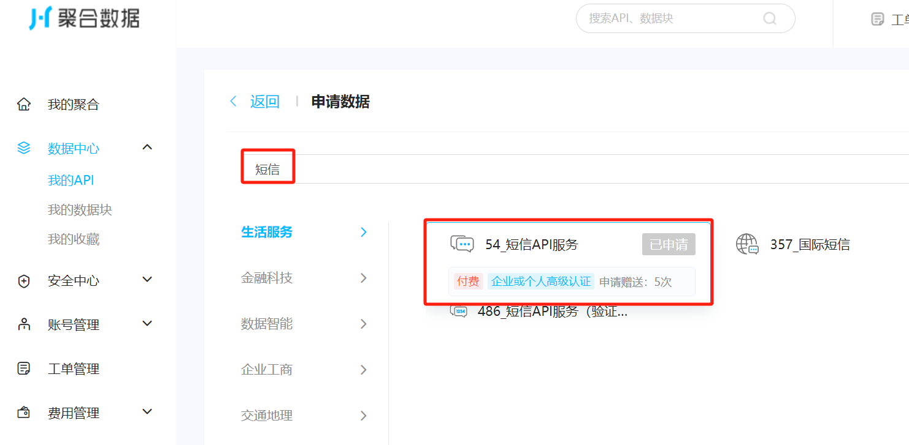
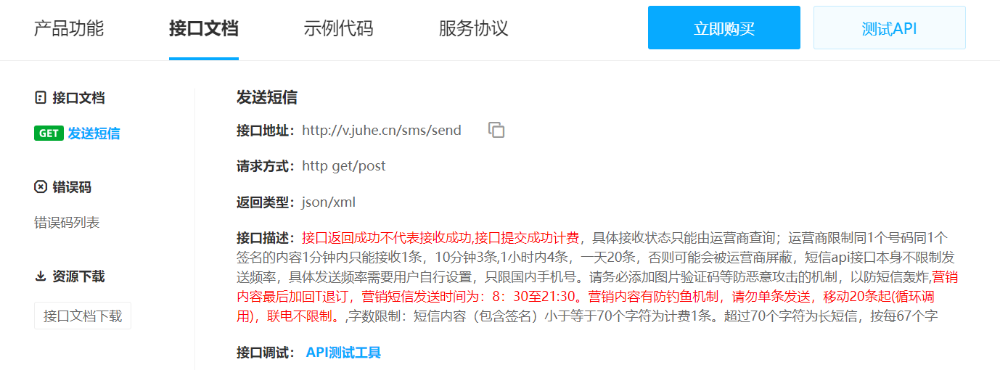

# 使用聚合数据平台开发手机短信验证码接口

## 1. 注册聚合数据账号

访问[聚合数据](https://www.juhe.cn/)，注册账号，并登录。

## 2. 申请短信验证码API

找到个人中心-数据中心-我的API，点击申请新数据，然后搜索短信



申请完之后再我的 API 中可以看到短信验证码API 数据服务


这里的请求Key 在下文调用api时会用到

## 3. 创建短信模板
点击“模板”，进入模板管理页面


然后创建模板，根据实际情况填写模板内容即可，创建完模板后，会得到一个模板ID，下文调用接口时会用到


## 4. 查看短信API服务的使用说明

点击进入短信API服务，查看使用说明

**接口说明**


**接口参数说明**


## 5. 使用nodejs调用短信API服务

这里使用的的是 `nodejs` 的方式调用，`index.js` 代码如下

```js
const axios = require('axios');
const querystring = require('querystring');

const queryData = querystring.stringify({
    "mobile": "13429667914",  // 接受短信的用户手机号码
    "tpl_id": "111",  // 您申请的短信模板ID，根据实际情况修改
    "tpl_value": "#code#=1235231",  // 您设置的模板变量，根据实际情况修改
    "key": "您申请的ApiKey",  // 应用APPKEY(应用详细页查询)
});

const queryUrl = 'http://v.juhe.cn/sms/send?'+queryData;

axios.get(queryUrl).then((res) => {
  console.log(res.data);
});

```

**注意**：

1. 需要替换 `key` 和 `tpl_id` 为你自己的应用的“申请key” 和 “短信模板id”
2. `tpl_value` 中 `#code#` 为模板变量，通常用来填充短信内容，`1235231` 为随机生成的验证码，根据实际情况修改
3. 需要替换 `mobile` 为你要发送短信的手机号码，在真实场景下通常作为变量传入

## 6. 测试短信验证码接口

在控制台输入 `node index.js` 即可测试短信验证码接口
