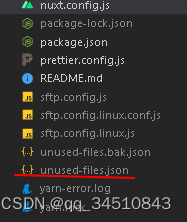

## 1.  安装插件 

```js
useless-files-webpack-plugin
```
## 2. 修改配置文件
> 在nuxt.config.js 中加入插件useless-files-webpack-plugin
```js

const UselessFile = require('useless-files-webpack-plugin')

export default {
	...,
	build: {
		pliguns: [
		    new UselessFile({
		    root: path.resolve(__dirname, './components'), // 项目目录
		    out: './fileList.json', // 输出文件列表
		    clean: false, // 是否删除文件,
		    exclude: /node_modules/ // 排除文件列表
		  })
		]
	}
}
```
## 3. 执行
> 项目运行之后会在根目录生成一个 unused-files.json 文件，里面记录的就是无用的文件路径



