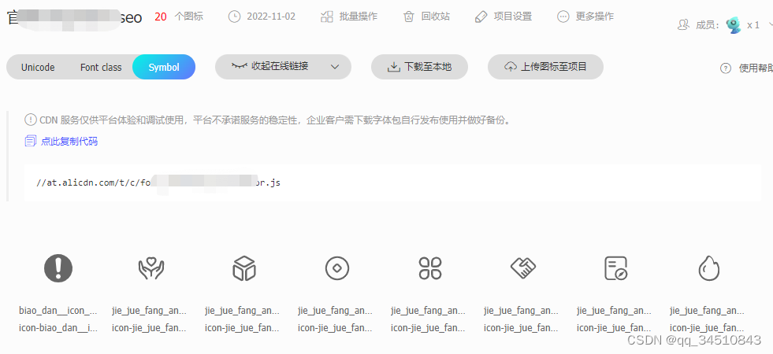
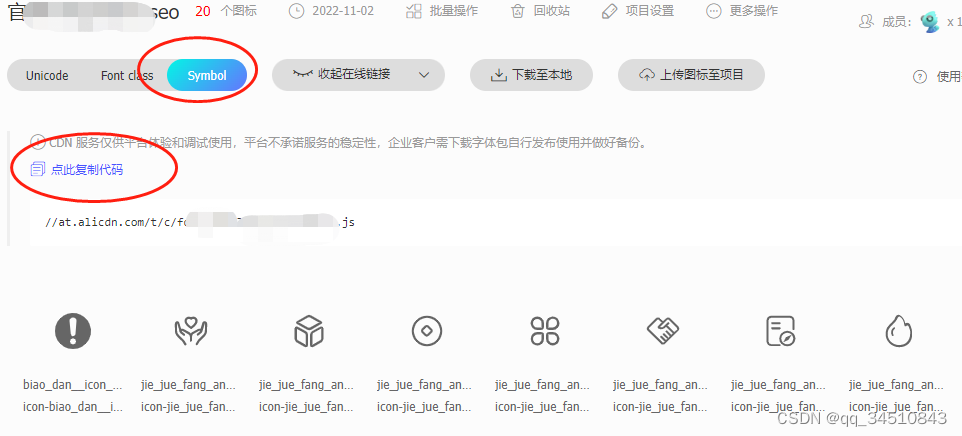
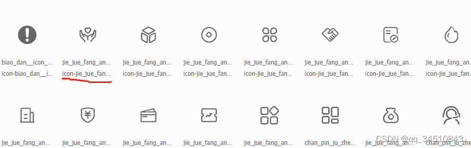

# vue 项目中 使用阿里图标库扩展antd 组件 icon 的图标
## 第一步：创建图标库
在https://www.iconfont.cn/ 创建自己的图标库，首相创建项目，然后把Svg 图标上传到该项目，一下是部分上传完之后的图标预览图。



## 第二步：vue项目引入图标库，注册图标
在图标项目页面中选择symbol 并点击“点此赋值代码”，把js 链接复制下来

把复制好的链接注册到代码中
```js
// ...
const MyIcon = Icon.createFromIconfontCN({
  scriptUrl: '//at.alicdn.com/t/font_8d5l8fzk5b87iudi.js', // 在 iconfont.cn 上生成
});
// 全局注册组件
Vue.component('my-icon', MyIcon)
```

## 第三步：调用
```js
<my-icon type="icon-jie_jue..." />
```
其中icon-jie_jue...就是上传到图标库之后的图片的名字

